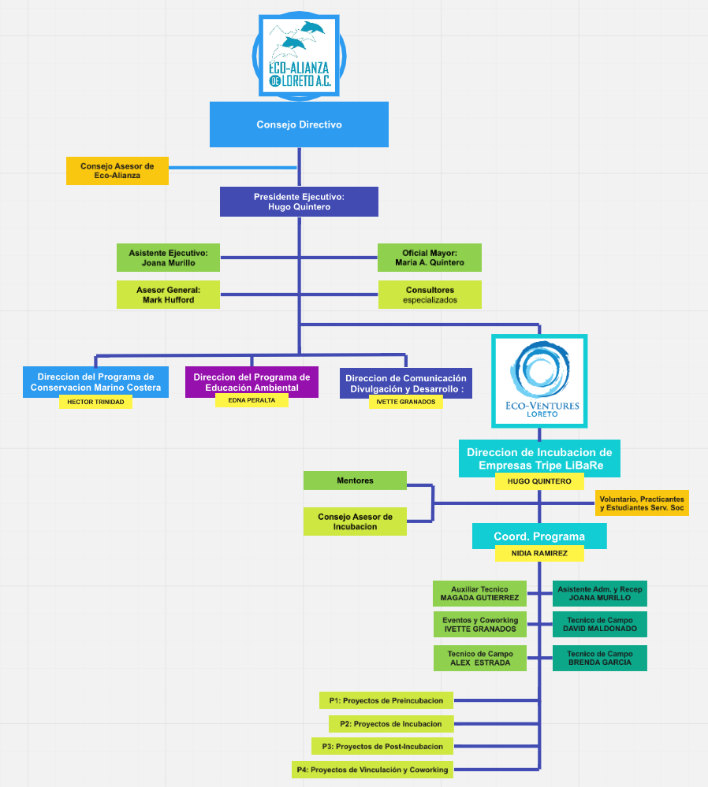

### 2. Administración y Personal

#### 2.1 Operación del Programa

**Nuestro programa incluye tres componentes principales:**

* La estructura legal y organizacional
* El personal, mentores y consultores
* Nuestras Alianzas y Vinculaciones

**Estructura legal y organizacional **

Funcionamos bajo la estructura de nuestra organización anfitrión: **Eco-Alianza de Loreto A.C.**, que es matriz, sede y origen de la iniciativa **Eco-Ventures**, como programa de incubación de empresas de operacion independiente, pero que se mantiene bajo el mismo estado legal, junta directiva y estructura de una organización no lucrativa.

En base a los alcances declarados en su misión y visión, Eco-Alianza de Loreto, a traves de su Consejo de Administración, aprobó la estructura y programa de incubación con Fecha 23 de Abril del 2015.

**Términos de operación anfitrión del  programa de incubación:**

* Consejo asesor independiente
* Programa de Voluntariado Independiente 
* Programa de Mentores Independientes
* Uso de espacio de las instalaciones y de equipos de la organización anfitrión

**Estatus Fiscal:**

El programa se mantiene adherido al mismo estatus de organización no lucrativa, con operaciones diversas, receptora de donaciones y emisora de recibos deducibles de impuestos por donaciones y/o subvenciones; con las mismas autorizaciones emitidas por el SAT para la organizacion anfitrión.

**El personal, mentores y consultores:**

* **Director de Programa:**
  * Responsabilidades: Mentoria en la creación de emprendas. Desarrollo de la red de integrada de mentores, eventos y programas. Desarrollo de los medios de acceso al capital y clientes a través de los vínculos. Asistencia y supervicion de las actividades de programa, instalaciones, presupuestos, supervisión de personal, políticas, procedimientos. Gestión de programas, a traves del desarrollo de negocios y las relaciones con los patrocinadores, socios y su reclutamiento. La vinculaciones y comercializacion del ecosistema emprendedor. La Planificación Estratégica y evaluación de la eficacia.
* **Coordinador del Programa:**
  * Es responsable de la gestión de los proyectos del Programa y de los servicios para los clientes, asi como mentor de incubandos. Es enlace del ecosistema emprendedor y las plataformas de incubación. Actua como agente de las relaciónes públicas. Supervisa la logística de los eventos, y la operación de espacios de coworking. Auxiliar en la incubación y el enlace con mentoring especializado. Da coordinacion al fomento del emprendimiento a traves de las inciativas del programa.
* **Auxiliares Tecnicos y de Campo:**
  * Pesonal especializado del programa que brinda consejo y asesoria en los aspectos especificos de su area profesional, quienes ademas determinan los entrenamientos necesarios 
* **Coordinador de Eventos y Coworking:**
  * Personal encargado de la la planeacion, logistica y promocion de los eventos del programa.
  * **Asistente administrativo:**
  * funciona como un enlace entre el personal que ejecuta el programa, ayuda con las operaciones del día a día en las instalaciones y de las empresas en incubacion, y de la recepcion.
* **Mentores:**
  * Colaboran en el proceso de elección de los proyectos que ingresarán a los servicios de incubación. Su rol posterior es el de asesorar y apoyar a cada uno de los proyectos de incubacion de acuerdo a la demanda y necesidades particulares.
* **Consejo Asesor:**
  * Su función es estrictamente consultivo; y no como un órgano de gobierno. El consejo asesor informará al director del programa y servirá a su discreción, como un consejo asesor especializado que proporciona información valiosa y de retroalimentacion.
* **Voluntariado:**
  * Son miembros de la comunidad que apoyan de manera honoraria y voluntaria en todas las actividades del programa, como red de soporte an las actividades y de la logistica de los eventos.

**EL ORGANIGRAMA DE LA INCUBADORA ESTA **[**AQUI**](https://drive.google.com/a/ecoalianzaloreto.org/file/d/0ByoBgBwWpuxHYnhkeW9HNjBmZXM/view?usp=sharing)

> **Nota:** Para poder acceder al enlace hay que solicitarlo a info@ecoalianzaloreto.net

#### 2.2 Escolaridad y experiencia laboral del Director de la Incubadora:

* El Director de la Incubadora se graduo en Diciembre del 2016 en la **Maestria en Enconomia del Medio Ambiente y los Recursos Naturales**, en la Universidad Autonoma de Baja California Sur, y actualmente se encuentra realizando la tesis de titulacion.
* Esta titulado y cuenta con cedula profesional como **Ingeniero Civil**, por el Instituto Tecnologico de La Paz.
* Obtuvo su certificado como **Director Responsable de Obras y estructuras de concreto**, por el Colegio de Ingenieros Civiles de Baja California Sur.
* ** En temas relacionados con la incubación de empresas ha obtenido los siguientes Diplomados, cursos o certificaciones :**
  * **Certificado en Administracion de Incubadoras de Empresas**, por la _International Business Innovation Association \(InBIA\)_
  * **Certificado en Emprendimiento Social**,  por Wharton - University of Pennsylvania - Global Social Impact House.
  * **Costancia de Capacitacion en el Estandar de Competencia 0217**, y proxima certificacion en Marzo del 2017, por la SEP

**EXPERIENCIA LABORAL DE LOS ULTIMOS 3 EMPLEOS:**

| Experiencia Laboral No.1 | Descripcion |
| :--- | :--- |
| Empresa | HUQUMA STUDIO DESIGN + BUILD |
| Fecha de Inicio | 01/2006 |
| Fecha de Finalización | ACTUAL |
| Puesto | Director General |
| Actividades principales | Mi involucramiento comprende las áreas de diseño, ingeniería y construcción; aplicadas al desarrollo de bienes raíces; bajo mi cargo está la dirección general de los proyectos, el desarrollo de las estrategias, la planificación, programación, presupuestos y control de costos, sistemas de construcción, y la construcción y gestión inmobiliaria. |

| Experiencia Laboral No.2 | Descripcion |
| --- | --- |
| Institución | Eco-Alianza de Loreto A.C. |
| Fecha de Inicio | 12/2007 |
| Fecha de Finalización | ACTUAL |
| Cargo | Presidente Ejecutivo y Cofundador |
| Actividades principales | Mis funciones han sido en relación al desarrollo de estrategias, definición de políticas y procedimientos internos, relaciones publicas con gobierno; y comunidad, implementación de programas y sistemas; recaudación de fondos y evangelista de nuestra misión y visión. |

| Experiencia Laboral No.3 | Descripcion |
| --- | --- |
| Institución | Fideicomiso de Obras de Infraestructura Social del Municipio de Loreto B.C.S. |
| Fecha de Inicio | 01/2009 |
| Fecha de Finalización | 04/2016 |
| Cargo | Presidente del Subcomite de Obras |
| Actividades principales | Mi función era presidir las sesiones y dirigir los debates, convocar su celebración, proponer el orden del día, votar cualquier asunto, emitir voto de calidad en caso de empate presentar ante comité técnico los acuerdos y propuestas definidas en las sesiones, coordinar y organizar las licitaciones, pago de anticipos y de estimaciones, inspeccionar y vigilar la ejecución de las obras. |

#### 2.3 Número de empleados en la Incubadora

**9 \(Nueve\) Empleados**

#### 2.4 De éstos, ¿cuántos desempeñan prioritariamente las siguientes funciones?

* Servicios Profesionales \(Directivos, Consultores, Mentores, etc.\): 7 PERSONAS
* Labores Administrativas: 2 PERSONAS

#### 2.5 Del total de mentores o consultores:

* ¿Cuántos trabajan de tiempo completo? : 5 PERSONAS
* ¿Cuántos trabajan tiempo parcial?: 2 PERSONAS
* ¿Cuántos trabajan tiempo parcial y voluntario?: 5 PERSONAS

