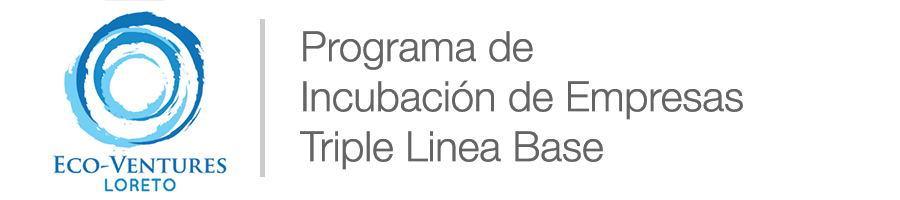
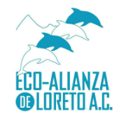
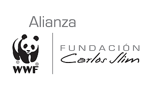

# Herramientas y Recursos

## Recursos para el Entrenador:

### Pensamiento Diseñador \(Design Thinking\)

* [Talleres de Diseño - \(Video\)](https://vimeo.com/149770666)
  * Una reunión organizada para fomentar la creatividad y la colaboración a fin de promover la integración de los equipos y generar soluciones innovadoras para un proyecto. Mira el vídeo y entende cómo usarlo.
* [Perfil de Personas - \(Video\)](https://vimeo.com/149768514)
  * Son personajes de ficción destinados a generar y validar ideas. Se crean a partir de la síntesis de las conductas significativas observadas durante la investigación de campo. ¿Quieres saber más? ve el video explicativo.
* [Cuadernos de Sensibilizacion - \(Video\)](https://vimeo.com/149768512)
  * Recopila datos sobre tu audiencia enfoque en el contexto en que se produce y con lo mínimo posibles de interferencias. Conoce a los deseos y expectativas que apoyen la toma de decisiones pertinentes y prepara al usuario para sesiones de colaboración. Aprende cómo, en el video.
* [Prototipar - \(Video\)](https://vimeo.com/149779342)

  * ¿Cómo saber si la solución desarrollada en la teoría funciona cuando se aplica en la práctica? Aprende a anticipar los problemas, tangibilizar conceptos y refinar las ideas por medio del video.

  [Cuaderno de Actividades ](https://drive.google.com/open?id=0ByoBgBwWpuxHN1VhdjZ1eXlWVEE)

### Otros

* [Guia para organizar eventos "Startup Weekend"](https://startupweekend.gitbooks.io/swguide/content/)
* [Manual para Validaciones Lean](http://leanvalidation.hanno.co)
* [Aplicacion Web de MySBM](http://mysbm.org/en/)
* [Catalyst Open-Tools](http://projects.sigma-orionis.com/catalyst/open-tools/)
* [Service Design Tools](http://www.servicedesigntools.org):  Una coleccion de herramientas libres \(Creative Commons\) para usarse en el diseño de procesos de sistemas complejos.
* [Design Thinking en Español \(Pensamiento Diseñador\)](http://designthinking.es/home/index.php)
* [Kumu](https://www.kumu.io) : plataforma de visualización de datos que ayuda a organizar información compleja en los mapas interactivos de relación.

## Recursos para el emprendedor

### Proyectos de Turismo

* [GUÍA METODOLÓGICA: IDENTIFICACIÓN Y DISEÑO DE PROYECTOS EN TURISMO SOSTENIBLE](https://drive.google.com/open?id=0ByoBgBwWpuxHc3JEVXRydThabGM)
* [GUIA DE MEJORES PRACTICAS DE ECOTURISMO EN AREAS PROTEGIDAS](https://drive.google.com/open?id=0ByoBgBwWpuxHb0JrNDVFU09xSm8)
* [MANUAL DE HERRAMIENTAS PARA NEGOCIOS EN TURISMO SUSTENTABLE](https://drive.google.com/open?id=0ByoBgBwWpuxHSHQyc1EzM0kyMGM)
* [TRAMITES PARA INCORPORAR AL TURISMO COMO ALTERNATIVA](https://drive.google.com/open?id=0ByoBgBwWpuxHeDdmUzdyNUVsdWs)

### De Financiamiento

* [Matriz de Subsidios Federales 2014 \(TNC\)](https://1drv.ms/x/s!ApHnTLE36GM1zwjcOG2uJiVYiMzV)
* [Red de apoyo al emprendedor \(INADEM\)](https://www.redemprendedor.gob.mx)
* [Imagination for People](http://imaginationforpeople.org/en/about_us/)
* [Fondeadora: ](https://fondeadora.mx)Plataforma de Fondeo Colectivo o Crowdfunding, una nueva forma de fondear proyectos creativos, ayudando cualquier emprendedor a promover sus ideas y encontrar el financiamiento que necesita para poder materializarlas.
* [Playbusiness:](https://playbusiness.mx/) Plataforma en linea de “crowdequity” o inversiones colectivas. Modelo similar al crowdfunding, pero con una diferencia clave: las Emprendas \(startups\) ofrecen un porcentaje de participación de la empresa.

### Otros

* [The Feedback Commons](http://feedbackcommons.org): Es un repositorio de preguntas de encuesta y puntos de referencia asociados, que las organizaciones pueden utilizar para recopilar e interpretar la retroalimentación, con el fin de mejorar su desempeño y obtener mejores resultados para sus constituyentes: beneficiarios, socios, usuarios de servicios, inversores, o otros.
* [Brandisity:](https://brandisty.com) Repositorio en linea de identidades de marca
* [Creative Commons](https://creativecommons.org): Licenciamientos Libres

### Aqui el Indice o Catalogo de Herramientas \(los enlaces estan en progreso\):

* DE EXPLORACION
* DIAGRAMA DE FLUJO DE LA INNOVACIÓN
* PLANIFICACIÓN DE PRUEBAS
* PARA DESARROLLO DE PLANES O PROYECTOS
* LIENZO DE MODELO DE NEGOCIO
* MAPA DE CREACIÓN DE ALIANZAS
* CICLO DE APRENDIZAJE
* ANALISIS FODA
* PARA DEFINIR PRIORIDADES
* DIAGRAMA DE CAUSAS
* TEORIA DEL CAMBIO
* GIRA DE LA EXPERIENCIA
* PARA RECLUTAR SOCIOS Y COLABORADORES
* MAPA DE PERSONAS Y CONEXIONES
* GRUPO OBJETIVO
* MAPA DE PROMESAS Y POSIBILIDADES
* PARA LA GENERACION DE NUEVAS IDEAS
* MAPA DE VALOR
* SOMBREROS PARA PENSAR
* TALLER CREATIVO
* .....

#### Creditos

Este repositorio es mantenido y finaciado por [Eco-Alianza de Loreto](http://ecoalianzaloreto.org) y la [Alianza WWF-Fundacion Carlos Slim](http://www.wwf.org.mx/quienes_somos/nuestras_alianzas/alianza_wwf_fundacion_carlos_slim/)

#### Licencia

Copyright - Derechos Reservados © 2016 [Eco-Ventures Loreto](http://ecoventures.strikingly.com).

